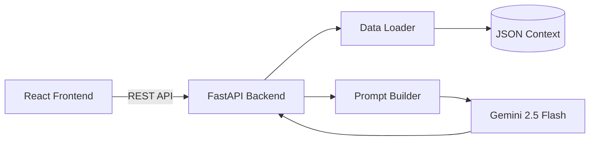
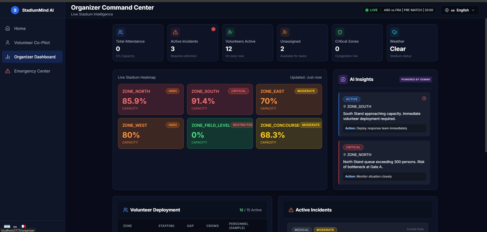

<div align="center">
  <h1>🏟️ StadiumMind AI</h1>
  <p><strong>AI Volunteer Co-Pilot for FIFA World Cup 2026</strong></p>
  <p><em>Empowering 92,000-capacity stadiums with real-time, context-aware AI.</em></p>
  <p>🏆 <strong>Google Prompt Wars Virtual Challenge 2026 Submission</strong> 🏆</p>
</div>

---

## 🚨 The Problem

Managing a FIFA World Cup stadium with 92,000 attendees is a monumental logistical challenge. Real-world problems include:
- **Information Asymmetry**: Volunteers are the face of the event but often lack real-time information about gate closures, VIP movements, or transport delays.
- **Language Barriers**: Fans from all over the world require assistance in dozens of languages.
- **Emergency Bottlenecks**: In a crisis, standard protocols are hard to look up under pressure, leading to delayed responses.
- **Dynamic Crowd Shifts**: Organizers struggle to proactively reallocate staff based on shifting crowd densities.

## 💡 The Solution

**StadiumMind AI** solves these challenges using **Retrieval-Augmented Generation (RAG) powered by Google Gemini 2.5 Flash**. By feeding the AI real-time, structured JSON data about the stadium, crowd, transport, incidents, and match state, the AI acts as an omniscient, context-aware co-pilot.

## 👥 Personas

1. **Stadium Volunteers (Primary)**
   - *Why*: Volunteers are the most numerous staff members and interact directly with fans. They need instant, accurate answers and translations in high-stress, noisy environments.
2. **Stadium Organizers (Secondary)**
   - *Why*: Organizers need a macro-level view of operations, crowd flow, and active incidents to make data-driven decisions and allocate resources effectively.

## ✨ Core Features

1. **AI Q&A Co-Pilot**: Volunteers can ask natural language questions (e.g., "Where is the nearest medical tent for Gate B?") and get answers grounded in real-time stadium data.
2. **Context-Aware Translation**: Instant translations tailored to stadium terminology, ensuring fans get accurate directions in their native language.
3. **Emergency Response AI**: Generates instant, step-by-step safety protocols based on incident severity, type, and location context.
4. **Live Crowd Analytics**: Heatmaps and density statistics to monitor congestion in real-time.
5. **AI Task Allocation**: Automatically identifies staffing gaps and assigns available volunteers to high-priority zones based on current crowd data.

## 🧠 AI Workflow

```text
[User Query] ──> [FastAPI Backend]
                       │
                       ▼
            [Context Loader Service]
            (Stadium, Crowd, Incidents)
                       │
                       ▼
             [RAG Prompt Builder]
             (Merges query + context)
                       │
                       ▼
              [Google Gemini API]
                       │
                       ▼
             [Structured Response] ──> [React UI]
```

## 🛠️ Prompt Engineering Strategy

Our approach relies heavily on **Retrieval-Augmented Prompting**. We do not fine-tune; instead, we inject 6 specific domain files (`stadium.json`, `crowd.json`, `transport.json`, `volunteers.json`, `incidents.json`, `match.json`) into the system prompt for every Gemini API call. 

This guarantees:
- **Zero Hallucinations**: The model is strictly instructed to answer *only* using the provided JSON state.
- **Contextual Accuracy**: If Gate C is closed due to a spill, the AI knows and routes fans accordingly.
- **Role-Based Framing**: The system prompt enforces a concise, actionable tone suitable for on-the-ground volunteers.

## 🏗️ Architecture Overview



## 💻 Tech Stack

| Layer | Technology | Purpose |
|-------|------------|---------|
| **Frontend** | React 19, Vite, Tailwind CSS | Fast, responsive Single Page Application. |
| **Backend** | FastAPI, Python 3.11 | High-performance async API routing. |
| **AI/LLM** | Google Gemini 2.5 Flash | Lightning-fast reasoning and text generation. |
| **SDK** | `google-generativeai` | Interfacing with the Gemini API. |

## 📂 Folder Structure

```
StadiumMindAI/
├── frontend/              # React UI
│   ├── src/pages/
│   ├── src/components/
│   └── ...
├── backend/               # FastAPI
│   ├── routes/
│   ├── services/
│   ├── prompts/
│   └── ...
├── data/                  # RAG JSON Context Files
└── docs/                  # Extensive Documentation
```

## 🚀 Installation & Setup

### Prerequisites
- Node.js (v18+)
- Python 3.11+
- Google Gemini API Key

### 1. Clone the Repository
```bash
git clone https://github.com/your-org/StadiumMindAI.git
cd StadiumMindAI
```

### 2. Backend Setup (FastAPI)
```bash
cd backend
python -m venv venv
# On Windows: venv\Scripts\activate
# On Mac/Linux: source venv/bin/activate
pip install -r requirements.txt
cp .env.example .env  # Add your GEMINI_API_KEY
uvicorn app:app --reload --port 8000
```

### 3. Frontend Setup (React/Vite)
```bash
cd frontend
npm install
cp .env.example .env.local # Verify VITE_API_BASE_URL
npm run dev
```

## 🔐 Environment Variables

**Backend (`backend/.env`)**
```env
GEMINI_API_KEY="your_google_gemini_api_key_here"
ENVIRONMENT="development"
PORT=8000
```

**Frontend (`frontend/.env.local`)**
```env
VITE_API_BASE_URL="http://localhost:8000"
```

## 📚 API Reference
We expose 19 comprehensive REST endpoints. See the full [API Documentation](docs/API.md) for schemas and examples.
- `POST /api/ai/ask`
- `GET /api/crowd/heatmap`
- `POST /api/volunteers/tasks`
- And more...

## 🧪 Testing

To run the backend test suite (pytest):
```bash
cd backend
pytest tests/ -v
```

## 📸 Screenshots

*(Replace placeholders with actual image paths)*
-  *Volunteer Q&A Interface*
-  *Live Crowd Heatmap & Insights*

## 🌐 Deployment
Ready for production? See our [Deployment Guide](docs/Deployment.md) for Docker, Google Cloud Run, and Vercel instructions.

## 🔭 Future Scope

1. **Real-time Firebase Integration**: Replace static JSON files with a live Firestore database.
2. **Computer Vision Crowd Counting**: Integrate CCTV feeds to update crowd densities automatically.
3. **WhatsApp Volunteer Bot**: Allow volunteers to query the AI directly via WhatsApp.
4. **Predictive Analytics**: Use historical data to predict congestion bottlenecks 30 minutes in advance.
5. **Multi-Modal AI**: Allow volunteers to upload photos of incidents (e.g., broken turnstile) for Gemini to analyze and route to maintenance.
6. **Wearable Integration**: Push urgent alerts to volunteer smartwatches.

## 🏆 Prompt Wars Challenge
This project was built for the Google Prompt Wars Virtual Challenge 2026. It deeply integrates Google GenAI, relies heavily on complex AI reasoning (RAG), features extensive documentation, and provides a highly practical, real-world utility for mega-events.

## 📄 License
This project is licensed under the MIT License.
