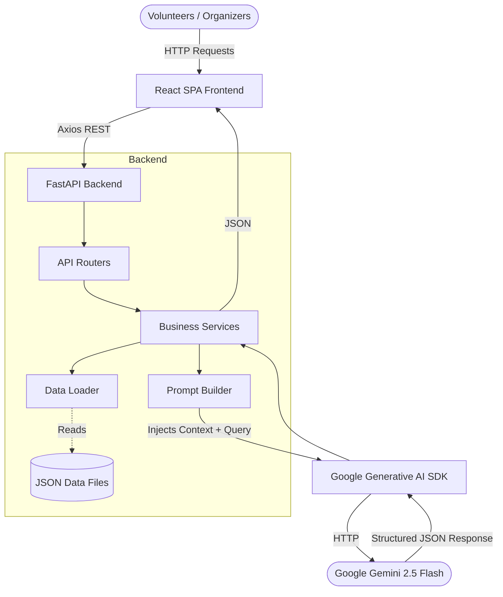
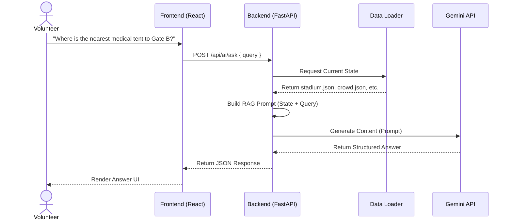

# Architecture Document

## 1. Overview
StadiumMind AI is designed as a decoupled, real-time-capable web application. It consists of a React Single Page Application (SPA) on the frontend, communicating via RESTful JSON APIs to a FastAPI backend. The backend acts as the orchestrator, loading mock state data (simulating a database) and constructing highly contextual prompts to query the Google Gemini API.

## 2. System Architecture Diagram



## 3. Component Architecture

```mermaid
graph TD
    App[App / Context Provider] --> DashboardLayout
    DashboardLayout --> Navigation
    DashboardLayout --> Pages
    
    subgraph Pages
        Pages --> VolunteerPage
        Pages --> OrganizerPage
        Pages --> EmergencyPage
    end
    
    subgraph Components
        VolunteerPage --> AIChatInterface
        VolunteerPage --> TaskList
        OrganizerPage --> CrowdHeatmap
        OrganizerPage --> KPIWidgets
        EmergencyPage --> IncidentReporter
        EmergencyPage --> AIActionProtocols
    end
```

## 4. Data Flow Diagram

**Example: AI Ask (Q&A)**



## 5. Backend Architecture

The FastAPI backend uses a layered architecture to maintain clean separation of concerns:
- **Routes (`/routes`)**: Endpoints that validate incoming requests (using Pydantic models) and delegate to services.
- **Services (`/services`)**: Business logic. `gemini_service.py` handles API calls to Google. `crowd_service.py` handles heatmap calculations.
- **Prompts (`/prompts`)**: Contains Python modules that format system prompts and inject context.
- **Data Loader (`data_loader.py`)**: Simulates a database abstraction layer by reading real-time state from the `/data` JSON files.

## 6. RAG Architecture (Retrieval-Augmented Prompting)

Instead of vector databases (which are better for large document retrieval), we use a **State-Injection RAG approach**. 

1. **Context Loading**: Every time an AI endpoint is hit, the `data_loader` reads the current JSON files.
2. **Context Merging**: The relevant data (e.g., only crowd and stadium data for directions) is serialized into formatted JSON strings.
3. **Injection**: The strings are injected into the `<STADIUM_CONTEXT>` block of the system prompt.
4. **Why this approach?**: A stadium's state fits easily within Gemini's context window. Full-state injection guarantees the LLM has the absolute latest data without the latency or inaccuracy of vector similarity searches.

## 7. Data Schema (Core Entities)

- **`stadium.json`**: `{ id, name, gates: [{id, status, type}], facilities: [{type, location}] }`
- **`crowd.json`**: `{ timestamp, zones: [{id, density_percentage, status}] }`
- **`incidents.json`**: `{ active_incidents: [{id, severity, location, description}] }`
- **`volunteers.json`**: `{ volunteers: [{id, role, location, status}] }`

## 8. State Management
The React frontend utilizes React Context (`AppContext.jsx`) to hold global UI state (like active user role) and custom hooks (`useAI.js`, `useStadiumData.js`) to encapsulate Axios calls and caching logic, ensuring components remain stateless where possible.

## 9. Security Considerations
- **CORS**: FastAPI is configured to only allow requests from specific frontend origins.
- **Input Validation**: All incoming requests are strictly validated via Pydantic schemas to prevent injection attacks.
- **PII**: The system is designed to use abstract IDs; no personally identifiable fan information is processed by the LLM.
- **API Key Protection**: The Gemini API key remains strictly on the backend server.

## 10. Scalability Path
- **Data Storage**: Migrate from local JSON files to **PostgreSQL/PostGIS** for robust, geospatial querying.
- **Real-time Updates**: Migrate from HTTP polling to **WebSockets** for pushing live incident alerts to the frontend.
- **AI Models**: Utilize Gemini Pro for complex backend analytics batch jobs, keeping Gemini Flash for real-time volunteer Q&A.

## 11. Performance Considerations
- **Caching**: Non-volatile state (like stadium layout) is cached in-memory on the backend.
- **Rate Limiting**: Implementation of API rate limiting middleware to prevent abuse.
- **Lazy Loading**: The React SPA lazy-loads page components to minimize initial bundle size.
